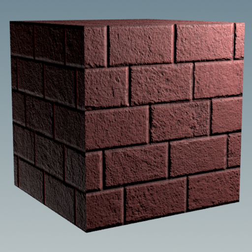

# MaterialX Shading Language
[](https://github.com/jakethorn/MXSL/blob/main/LICENSE)
[](https://github.com/jakethorn/MXSL/releases/latest)
[](https://github.com/jakethorn/MXSL/actions)
## Overview
This repo contains the language specification for the MaterialX Shading Langauge (MXSL) and the code for its open source compiler (mxslc). MXSL is a high level shading language with a syntax similar to C. It can be compiled into a MaterialX (.mtlx) to be used like any other MaterialX file. MXSL allows artists and developers to more quickly and easily create complex MaterialX shaders for their own projects.
## Quickstart
TODO
## Syntax
__Variable Declaration__
```
float f = 1.0;
```
__Variable Assignment__
```
f = 2.0;
```
__Compound Assignment__
```
f *= 3.0;
```
__Function Declaration__
```
color3 linearize(color3 c)
{
    return c ^ 2.2;
}
```
__For Loops__
```
for (float i = 0.0 : 10.0)
{
    // do something with i...
}
```
__Binary Operators__
```
float x = 1.0 + 2.0 - 3.0 * 4.0 / 5.0;
```
__Unary Operators__
```
float y = -x;
```
__Grouped Expressions__
```
float z = (y + 2.0) * 0.5;
```
__Constructors__
```
vec3 my_vec3 = vec3(1, 0, 0);
```
__Explicit Conversions__
```
vec4 my_vec4 = vec4(my_vec3);
```
__Standard Library Calls__
```
vec2 uv = texcoord();
color3 background = image("textures/skyline.png", texcoord=uv);
```
__User-defined Function Calls__
```
background = linearize(background);
```
__Swizzle Operator__
```
float red = background.r;
float blue = background.b;
float green = background.g;
color3 color_shifted = background.gbr;
```
__If Expressions__
```
color3 out_color = if (uv.x < 0.5) { background } else { color_shifted };
```
__Surface Shader Output__
```
surfaceshader surface = standard_surface();
surface.base_color = out_color;
```
## Examples
Red Brick                    |  Interior Mapping
:---------------------------:|:---------------------------:
   |  
__Shader Art (by Kishimisu)__    |  __Procedural Rain__
  |  
__Mountain Displacement__    |  
  |  
## Install __mxslc__
There are two ways to use __mxslc__. 
### 1. Download the source code and use it in your own python project.
The __mxslc__ python project contains a requirements.txt file that lists its dependencies.
Here is an example of how to use the package:
```
import mxslc

mxsl_file = "./test.mxsl"
mxslc.compile_file(mxsl_file)
```
The file `./test.mtlx` will be generated by the compiler.
### 2. Download the mxslc.exe executable from the most recent release.
This can be run from the command line:
`mxslc.exe ./test.mtlx`
Again, the file `./test.mtlx` will be generated by the compiler.
