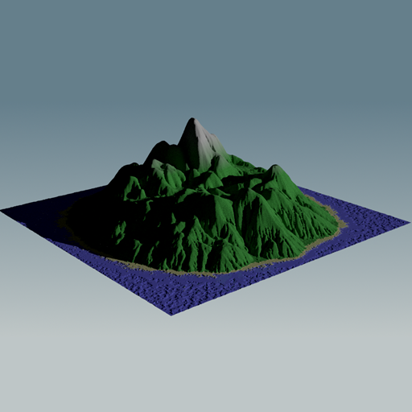

[](https://github.com/jakethorn/MXSL/blob/main/LICENSE)
[](https://github.com/jakethorn/MXSL/releases/latest)
[](https://github.com/jakethorn/MXSL/actions)

# ShadingLanguageX
ShadingLanguageX is a high level shading language that can be used to create complex MaterialX materials.  
  


# Starting Guide

## Installation
ShadingLanguageX source files are compiled to MaterialX (.mtlx) files using its open source compiler. The compiler is written in python and can be cloned or downloaded as a package and called from your own python project. 
```
import mxslc
mxslc.compile_file("grass.mxsl")
```
Alternatively, you can directly download the compiler executable from the most recent release and call it from the command line.
```
./mxslc.exe grass.mxsl
```
Both methods have the same input signature, a mandatory path to a ShadingLanguageX source file and then several optional arguments.

## Language Syntax
For information about ShadingLanguageX syntax and additional compiler options, see the [language specification](https://github.com/jakethorn/ShadingLanguageX/blob/main/language-spec/LanguageSpecification_v0_1-beta.md) document.  
You can also look through example source files [here](https://github.com/jakethorn/ShadingLanguageX/tree/main/examples) to see some uses of ShadingLanguageX.


# Examples
Red Brick                    |  Interior Mapping
:---------------------------:|:---------------------------:
   |  
__Shader Art (by Kishimisu)__    |  __Interior Mapping with shadows (by VRBN)__
  |  
__Displacement Mountain__    |    __Procedural Rain__
   |  
