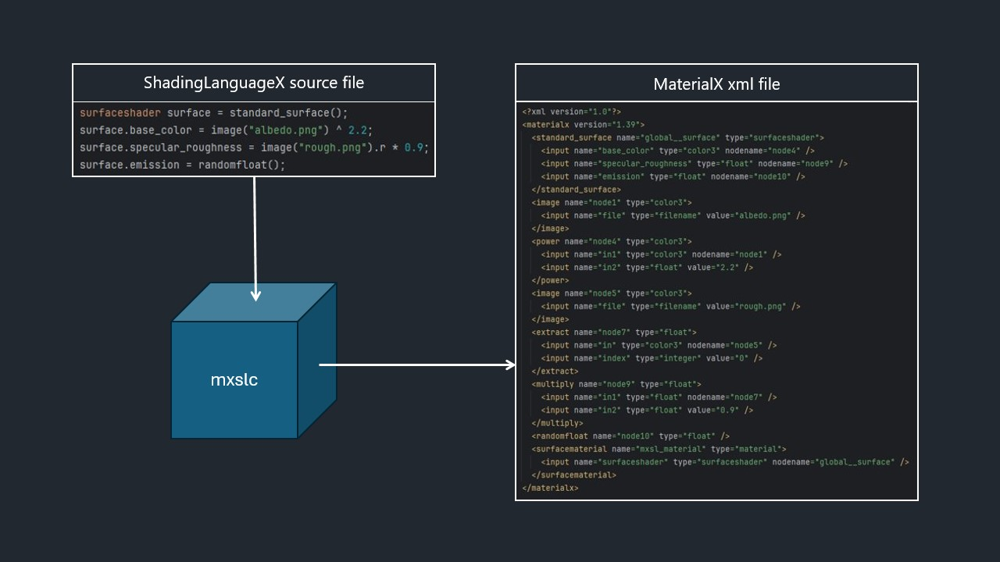

<h1 align="center">ShadingLanguageX</h1>

__ShadingLanguageX__ is a high level programming language that can be used to create complex [MaterialX](https://materialx.org/) shaders.  
  


# How It Works
  

__ShadingLanguageX__ source files are compiled to MaterialX (.mtlx) files using the mxslc compiler. Internally, the source file is tokenized and parsed into a list of statements and expressions which in turn map to one or more MaterialX nodes. These nodes are then written to the MaterialX output file as shown in the diagram above.  
For example, the `+` operator (e.g., `float x = 1.0 + 1.0;`) intuitively compiles to the `add` node, and the same for all other mathematical operators. `if` expressions compile to either of the `ifgreater`, `ifgreatereq` or `ifequal` nodes depending on the condition. `switch` expressions compile to the `switch` node. The swizzle operator (e.g., `some_vector.xy`) compiles to `extract` and `combine` nodes. Most MaterialX nodes are represented by a standard library function that is built into the language, such as `color3 c = image("albedo.png");` which compiles to the `image` node. Additionally, declaring a variable (e.g., `vec3 up = vec3(0, 1, 0);`) compiles to a `constant` node (or a `combine` node depending on the inputs to the expression).  


# Why Use ShadingLanguageX?

Currently, MaterialX shaders can be made either using the MaterialX C++ or Python APIs, or using a node editor software. __ShadingLanguageX__ offers an additional way to create MaterialX shaders that provides several benefits over existing methods.
* __Start and Iterate Quickly__ The MaterialX API can be quite verbose to use when writing shaders because it needs to provide control over every aspect of MaterialX. Developers can write their own wrappers around the API, but this takes time and knowledge about MaterialX and either C++ or Python. __ShadingLanguageX__ provides less functionality than the MaterialX API, but in return provides a language with a simple syntax, that was developed specifically for building MaterialX shaders. This allows developers to get started and iterate on ideas quickly. There is no setup code to write, just the shaders and a call to the compiler.
* __Manage Compexity and Reuse Code__ Similarly, node editors can become difficult to use when developing shaders with a large number of nodes and often have limited function reusability features between shaders. __ShadingLanguageX__ provides for loops, user-defined functions and `#include` directives that make it easier to create shaders with thousands of nodes and reuse code between projects.
* __Shader Readability__ Another benefit of __ShadingLanguageX__ is that it is very readable. As mentioned previously, the MaterialX API can be quite verbose, obscuring the logic of the shader and staring at a network of nodes is not much easier.  __ShadingLanguageX__ has a concise syntax targetted specifically for MaterialX shaders which results in code with logic that is more easily understandable.


# Showcases
Procedural Rain                    |  Interior Mapping
:---------------------------:|:---------------------------:
   |  
__Shader Art (by Kishimisu)__    |  __Interior Mapping with shadows (by VRBN)__
  |  
__Displacement Mountain__    |    __Other Examples__
   |  


# Getting Started

## Installation
__ShadingLanguageX__ source files are compiled to MaterialX (.mtlx) files using its open source compiler (mxslc). The compiler is written in python and can be cloned or downloaded as a package and called from your own python project. It has been tested with Python 3.12 and 3.13. 
```python
import mxslc
mxslc.compile_file("my_shader.mxsl")
```
Alternatively, you can download the compiler executable from the most recent release and call it from the command line.
```
> ./mxslc.exe my_shader.mxsl
```
Both examples will output a `my_shader.mtlx` file which can then be used as you would any other MaterialX file. Both methods have the same input signature, a mandatory path to a __ShadingLanguageX__ source file and then several optional arguments, such as setting the output files directory and name.

See below for information about the [interactive compiler]().

## Language Specification
For information regarding __ShadingLanguageX__ syntax and mxslc compiler options, see the __ShadingLanguageX__ language specification [document](https://github.com/jakethorn/ShadingLanguageX/blob/main/docs/LanguageSpecification.md). Examples of __ShadingLanguageX__ shaders in addition to the one below can be found in the examples [directory](https://github.com/jakethorn/ShadingLanguageX/tree/main/examples).

## Example
```
// squares.mxsl

void main(float tiling)
{
    vec2 scaled_uv = texcoord() * tiling;
    float seed = floor(scaled_uv.x) + floor(scaled_uv.y) * tiling;
    color3 c = randomcolor(seed);
    standard_surface(base_color=c);
}
```
Compile using python:
```python
import mxslc
mxslc.compile_file("squares.mxsl", main_args[10.0]);
```
or executable:
```
> ./mxslc.exe squares.mxsl -a 10.0
```


## Interactive Compiler (Experimental)
The python installation also comes with an interactive compiler which allows the user to call __ShadingLanguageX__ functions and access variables from python. This is useful if more complex logic is needed when compiling the shader, such as checking for missing textures files, or updating values or logic based on a configuration file.
For example:
```
color3 logic_1(filename texture_path)
{
    // some logic here
}

color3 logic_2(color3 c)
{
    // some other logic here
}

void main(color3 c)
{
    standard_surface(base_color=c);
}
```
```python
from pathlib import Path
import MaterialX as mx
import mxslc

compiler = mxslc.InteractiveCompiler()
compiler.include(Path("./my_shader.mxsl")

shader = compiler.get_shader_interface()
texture_path = Path("../textures/my_texture.png")
if texture_path.exists():
    c = shader.logic_1(texture_path)
else:
    c = shader.logic_2(mx.Color3(1, 0, 0))
shader.main(c)

compiler.save(Path("./my_shader.mtlx"))
```


# Contributing
Please try out __ShadingLanguageX__ and start a discussion about a feature you'd like to see or an issue if you find a bug, or feel free to contribute directly to the project by opening a pull request!
